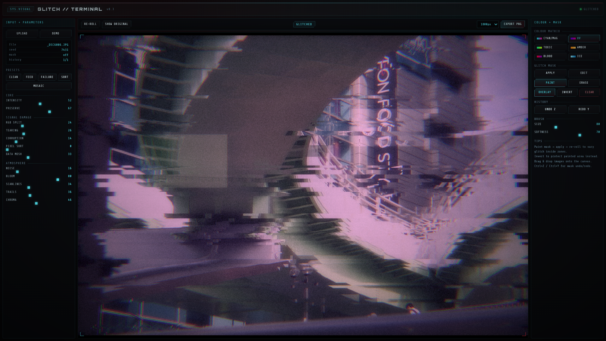

# GLITCH//TERMINAL v0.4

An experimental browser-based image glitch tool with a cyberpunk terminal-style interface.

GLITCH//TERMINAL lets you load an image, route it through layered distortion effects, paint targeted glitch masks, and export stylised corrupted stills directly from the browser.

** NOTE: Desktop-first for now. Mobile support is planned, but the current layout is designed primarily for desktop and laptop browsers.**

## Screenshot

## Features

- Browser-based, no install required
- Upload your own image
- Drag and drop support
- Live glitch controls
- Multiple presets
- Multiple colour palettes
- Paintable glitch masks
- Mask invert and overlay
- Undo and redo for mask edits
- Export PNG at multiple resolutions
- Cyberpunk terminal-inspired UI

## Current effects

- RGB split
- Tearing
- Corruption
- Noise
- Bloom
- Scanlines
- Trails
- Pixel sort
- Data mosh style distortion
- Chroma shift

## Why I made this

This started as an experiment in building a stylish image manipulation tool with a strong cyberpunk identity, using a single browser-based HTML app.

It is not intended to be a polished commercial product yet. Right now it is more of a creative playground, a visual tool, and a proof of concept for how far this kind of browser-native image processing can be pushed.

## How to use

1. Open `index.html` in your browser
2. Upload an image or use the demo image
3. Adjust the glitch controls
4. Paint a mask if you want distortion only in selected areas
5. Re-roll until you get a variation you like
6. Export the final image as a PNG

## Files

- `index.html` — the main app
- `README.md` — project overview and usage notes
- `screenshot.png` — repository preview image

## Notes

- Best used on desktop or laptop
- Designed for still images, not animation or video
- Works entirely in the browser
- Rendering and export speed may vary depending on image size and device performance
- Fonts and visual rendering may vary slightly by browser and operating system

## Roadmap / possible future ideas

- Additional glitch styles and presets
- Stronger export and output options
- Animation or video-based glitch modes
- Smarter subject-aware masking
- Mobile-friendly layout and controls
- Potential app packaging later if the project grows beyond an experiment

## Status

**Experimental release — v0.3**

## License

TBD
